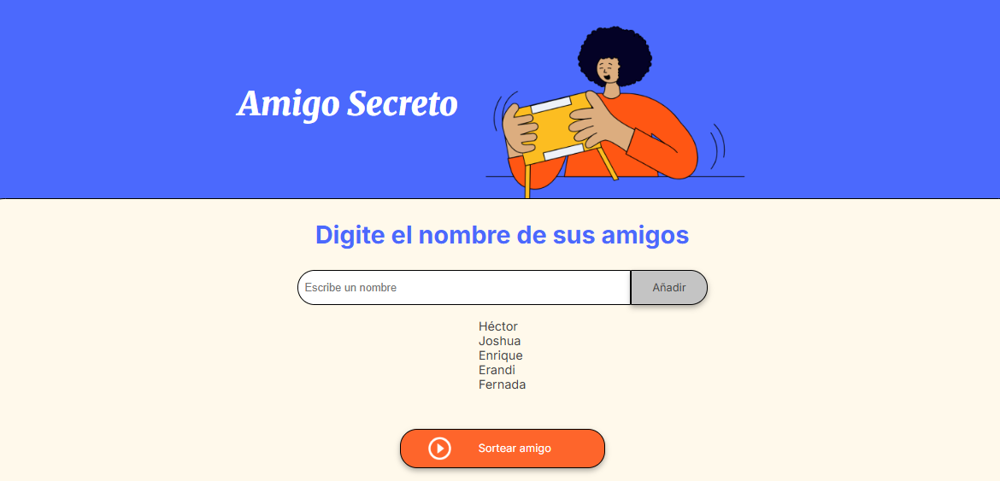

# Amigo Secreto 🎉

## Descripción del Proyecto
Este proyecto es una aplicación web simple que permite registrar nombres de amigos y realizar un sorteo para seleccionar un "amigo secreto" al azar. 
Es una excelente oportunidad para fortalecer habilidades en lógica de programación y manipulación del DOM con JavaScript.

## Estado del Proyecto 🚀
<h4 align="center">:white_check_mark: Proyecto Completo :white_check_mark:</h4>

## Características y Funcionalidades 🔥
- Agregar amigos a la lista.
- Mostrar la lista de amigos registrados.
- Realizar un sorteo aleatorio para seleccionar un "amigo secreto".
- Interfaz intuitiva con diseño responsivo.

## Tecnologías Utilizadas 🛠️
- HTML5
- CSS3
- JavaScript

## Capturas de Pantalla 📸

### Página Principal y visualización de la función agregarAmigo. Aquí se muestran las listas de amigos


### Aquí se muestra el resulado del sorteo


### Alerta por intentar agregar un nombre vacío


## Instalación y Uso 📌
1. Clonar el repositorio:
   ```bash
   git clone https://github.com/HectorSalazar027/AmigoSecreto.git
   ```
2. Acceder al directorio del proyecto:
   ```bash
   cd amigo-secreto
   ```
3. Abrir el archivo `index.html` en tu navegador.

## Uso 👨‍💻
1. Escribe el nombre de un amigo en el campo de entrada.
2. Haz clic en el botón "Añadir" para agregarlo a la lista.
3. Repite el proceso hasta registrar todos los amigos.
4. Haz clic en "Sortear amigo" para seleccionar un amigo secreto al azar.

## Contribución 🤝
Si deseas contribuir con mejoras al proyecto:
1. Realiza un fork del repositorio.
2. Crea una nueva rama (`git checkout -b feature/nueva-funcionalidad`).
3. Realiza los cambios y haz un commit (`git commit -m 'Agregada nueva funcionalidad'`).
4. Sube los cambios (`git push origin feature/nueva-funcionalidad`).
5. Crea un Pull Request.

## Autor 💡
<table>
  <tr>
    <td align="center">
      <a href="https://github.com/HectorSalazar027">
        <sub><b>Héctor Manuel Salazar Rubi</b></sub>
      </a>
    </td>
  </tr>
</table>


Si te gustó este proyecto, no olvides darle una estrella ⭐ en GitHub. ¡Feliz codificación! 🚀

